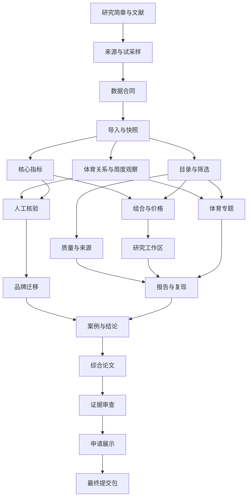

# Nike 运动品牌研究项目实施规划

> **给执行者：** 后续实施须使用 `superpowers:executing-plans` 按任务执行；若用户明确选择子代理方式，则使用 `superpowers:subagent-driven-development`。步骤采用 `- [ ]` 跟踪。当前交付范围是中文规划，任务勾选表示将来的执行状态。

**目标：** 以 Nike 篮球和足球产品为案例，完成可追溯的分析平台、一篇综合研究论文与研究生申请作品集。

**架构：** 将项目拆成研究与数据、分析平台、论文与申请作品集三条工作线。统一数据模型、冻结快照与分析接口连接各工作线；平台和论文读取同一分析结果。

**技术方案：** 首版建议采用 Python、DuckDB、Streamlit、pytest 和用于论文图表的 Matplotlib，原始资料使用 CSV／JSON，研究快照使用规范化 JSON 与派生 Parquet，报告使用 Markdown／HTML。依赖版本在实施任务 R03 中根据本机环境验证并固定；该方案是本轮提出的默认路线。

**设计依据：** `docs/运动品牌市场分析项目计划-v2.md`。该文件是现有讨论稿，目标专业、市场和截止日期仍属于工作假设；本计划没有把这些假设标记为已获确认。

## 全局约束

- 首期以一个市场、篮球与足球、成人实战鞋为核心；美国官方线上渠道为默认假设。
- Nike 与 Jordan 分别记录品牌，所属集团和财务口径另行描述。
- 型号、款式配色、价格观察是不同实体；主价格分析采用型号等权。
- 儿童款、定制款、生活方式款默认排除主比较，球衣单独分析。
- 保存当前售价和有证据的参考价，缺失参考价不计算折扣。
- `first_seen_at` 表示首次观察；`release_date` 只有明确来源时填写。
- 产品—球员—球队—赛事关系必须包含来源；时间共现另行表达。
- 主结果是所观察目录的供给结构与价格，不解释成销量或市场份额。
- 数据版本、查询参数、指标版本与结果一起保存；图表和论文使用同一版本。
- 研究快照不可覆盖，原始资料与派生结果分开保存。
- 页面说明、报告、研究文档与作品集使用中文；字段和代码标识可使用英文。
- 试采样目标为 30–40 条，正式工作量目标约 150–300 个款式配色；实际不足时如实记录。
- 人工核验目标为 60–80 条，迁移样本目标为 30–60 条；这些数字不等于代表性或统计功效。
- 评论、搜索趋势、多地区、复杂图谱、账号系统列为扩展，不阻断首版交付。

## 优先审查的五类情况

1. 同型号多配色与重复导入：不应增加型号权重，也不能静默覆盖旧观察。由 R04、R05 检查。
2. 缺失、非法价格与不同币种：应分别记录错误、缺失或拒绝混算。由 R03、R05、P03 检查。
3. 无证据的 NBA 标签与事件共现：不能当作明确合作关系。由 R06、P05 检查。
4. 空筛选、历史字段缺失和旧查询：应显示有效空结果或明确版本错误。由 P01、P04 检查。
5. 来源内容含特殊字符与快照文件变更：导出须安全转义，版本不一致须阻止复现。由 R04、P06 检查。

---

## 一、计划文件与阅读顺序

| 文件 | 范围 | 实施后的独立成果 |
|---|---|---|
| [研究与数据计划](2026-09-29-研究与数据.md) | R01–R08：范围、试采样、合同、导入、指标、证据、核验、迁移 | 可独立运行的数据与分析流程 |
| [分析平台计划](2026-09-29-分析平台.md) | P01–P06：目录、质量、比较、工作区、专题、报告 | 能完成完整分析任务的中文平台 |
| [论文与申请作品集计划](2026-09-29-论文与申请作品集.md) | A01–A05：案例、论文、审查、作品集、提交包 | 完整论文、演示及可复核研究包 |

先读设计依据，再读本文件，随后按任务依赖阅读相应子计划。每个子计划继承全局约束，不能在实施中自行换研究口径。

## 二、研究问题与论文主线

| 研究问题 | 对应任务 | 论文中的证据 |
|---|---|---|
| RQ1：统一模型能否描述商品层级、关系和来源，并迁移到其他品牌？ | R03、R04、R07、R08 | 字段覆盖、人工核验、错误与迁移记录 |
| RQ2：篮球与足球样本的产品组合、价格和技术表述有何差异？ | R05、P03、A01 | 同口径结果、分层比较、稳健性检查 |
| RQ3：产品与体育实体如何关联；观察变化与事件节点怎样共现？ | R06、P05、A01 | 明确关系证据、时间线和有限观察记录 |

先形成一篇综合论文。文献确认贡献后，再考虑后续独立论文。没有历史面板时，RQ3采用关系和案例研究，不承诺完整事件效果分析。

## 三、文件结构与职责

以下是将来实施时创建的文件，不表示这些文件目前已存在。

```text
docs/research/              研究简章、数据字典、文献、评价和决策
config/                    研究范围、分类规则与品牌映射
data/raw/                  原始商品、来源和事件记录
data/snapshots/            不可覆盖的研究快照与校验清单
data/working/              人工核验和迁移记录
src/sportbrand/contracts.py 共享数据类型、错误类型和查询合同
src/sportbrand/ingest.py    原始文件导入与校验
src/sportbrand/snapshots.py 快照生成、校验与读取
src/sportbrand/metrics.py   筛选、型号等权统计和指标
src/sportbrand/evidence.py  体育关系与事件证据
src/sportbrand/projects.py  研究工作区和已保存查询
src/sportbrand/reports.py   分析记录、报告与复现
src/sportbrand/cli.py       数据和报告的命令行入口
app.py                     中文界面入口和共享快照选择
ui/                        目录、质量、比较、工作区、专题和报告页面
tests/                     数据边界、统计口径和完整用户任务验证
paper/                     论文、图表、文献与结论证据表
portfolio/                 一页摘要、项目展示与演示脚本
```

关键边界：`metrics.py` 不依赖界面；`reports.py` 读取分析记录而非页面截图；界面读取已冻结快照。DuckDB 在进程内查询数据，首版不依赖多个进程同时写入一个数据库文件。该约束与官方并发说明一致。[DuckDB 并发文档](https://duckdb.org/docs/current/connect/concurrency)

## 四、依赖与任务顺序



文献和决策记录在整个项目期间持续更新。图中的先后依赖不要求研究写作等到平台完成后才启动。

## 五、16 周任务预算

| 任务 | 工作内容 | 周期 | 工时基准 |
|---|---|---|---:|
| R01 | 研究简章、范围和文献矩阵 | 第 1–3 周，持续更新 | 8 |
| R02 | 来源矩阵与 30–40 条试采样 | 第 1–2 周 | 10 |
| R03 | 数据合同、分类规则与项目环境 | 第 3 周 | 12 |
| R04 | 导入、去重与不可变快照 | 第 4–5 周 | 16 |
| R05 | 产品组合与价格指标 | 第 5–6 周 | 14 |
| R06 | 体育证据与周度观察 | 第 4–10 周及后续观察 | 10 |
| P01 | 商品目录与筛选 | 第 6 周 | 8 |
| P02 | 数据质量与来源详情 | 第 6 周 | 6 |
| P03 | 产品组合与价格比较 | 第 7 周 | 10 |
| P04 | 研究工作区与查询保存 | 第 7–8 周 | 6 |
| P05 | NBA／足球专题 | 第 9–10 周 | 6 |
| P06 | 报告、分析记录与复现 | 第 8–12 周 | 16 |
| R07 | 人工核验与修正记录 | 第 9–10 周 | 10 |
| R08 | 另一品牌的迁移评价 | 第 11 周 | 8 |
| A01 | 案例与稳健性检查 | 第 12 周 | 12 |
| A02 | 综合论文写作 | 第 13–14 周，前期累积材料 | 22 |
| A03 | 图表、引用和结论审查 | 第 15 周 | 10 |
| A04 | 申请作品集与演示 | 第 15–16 周 | 10 |
| A05 | 最终研究包与提交检查 | 第 16 周 | 6 |
| **合计** | **19 项任务** | **16 周基准** | **200 小时** |

200 小时对应平均每周约 12.5 小时。每周只有 10 小时时，应安排约 20 周或采用精简版；每周 15 小时可在 16 周中留下约 40 小时缓冲。工时是估算，采集失败、招募和新数据源会改变时间。

P06 分两次交付：第 8 周先导出目录／价格报告，第 10–12 周接入体育专题与完整复现。第一版不因专题尚未完成而阻断已有结果导出。

## 六、四个里程碑

- [ ] **M1，第 2 周：研究可行。** 有试采样、来源和缺失报告，主问题有真实字段支持；来源失败则缩范围或调整市场。
- [ ] **M2，第 8 周：分析闭环。** 从冻结快照筛选商品、生成价格结果、保存查询并导出基础报告。
- [ ] **M3，第 12 周：研究证据固定。** 完成人工核验、五个可复现问题、有限迁移和主结果，确定论文数据版本。
- [ ] **M4，第 16 周：申请成果可展示。** 论文、摘要、演示和研究包的数字及状态一致。

## 七、计划与执行的区分

本轮文件提供任务设计、接口和未来验收命令；没有采集真实商品、创建产品代码、安装依赖或运行其中的产品测试。研究结论、统计结果和功能完成状态须在执行阶段据实记录。

当前工作区尚非 Git 仓库。每项任务末尾的版本保存步骤在执行阶段采用 Git 提交；建立版本库及公开范围应随实际实施确定，原始数据是否能公开需单独判断。规划文件本轮不宣称已有提交记录。

对于核心口径和输入边界，实施时采用“先定义预期—验证未实现行为—实现—验证结果”的过程。研究文档和低风险文案使用人工检查，不为每段文字编造自动测试。

## 八、自审与覆盖记录

| v2 设计要求 | 对应任务 |
|---|---|
| 研究定位、来源、文献与采样 | R01、R02 |
| 分类、分析单位、数据字典 | R03 |
| 原始数据、快照与版本 | R04 |
| 产品组合、价格与解释边界 | R05、A01 |
| 体育关系、事件和时间观察 | R06、P05 |
| 人工评价、可迁移性 | R07、R08 |
| 六个页面和研究导出 | P01–P06 |
| 五个固定分析问题复现 | P06、A01 |
| 论文、证据、作品集 | A02–A05 |
| 风险、精简和扩展 | 本节和里程碑；各子计划的停止条件 |

12 周精简版优先 M1、M2、固定快照案例、论文草稿与演示；减少时间观察、迁移规模，省去用户试点及扩展数据源。24 周扩展版从评论、第二市场、较长面板或正式用户研究中选一个新增问题。

## 九、实施交接

建议采用当前会话逐项执行：数据字段、研究判断和平台接口依赖紧密，先以 R01、R02 验证可行性最合适。如果用户选择子代理执行，按任务接口分配并保留研究者的分类与结论审核。

进入实施前，按 Superpowers 的流程复核本计划和技术假设，并明确执行方式。用户本次要求是编写中文规划，因此本轮交付终点是这组可供评审的文件。
